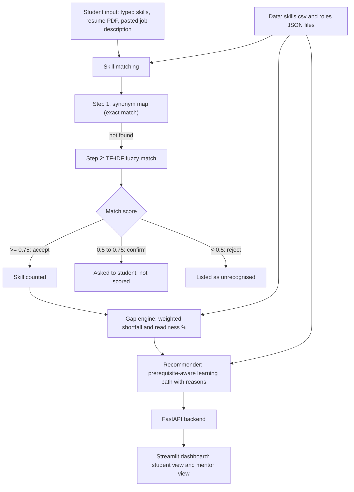

# Architecture

```mermaid
flowchart TD
    A["Student input: typed skills, resume PDF, pasted job description"] --> B["Skill matching"]
    B --> B1["Step 1: synonym map (exact match)"]
    B1 -->|"not found"| B2["Step 2: TF-IDF fuzzy match"]
    B2 --> C{"Match score"}
    C -->|">= 0.75: accept"| D["Skill counted"]
    C -->|"0.5 to 0.75: confirm"| E["Asked to student, not scored"]
    C -->|"< 0.5: reject"| F["Listed as unrecognised"]
    D --> G["Gap engine: weighted shortfall and readiness %"]
    G --> H["Recommender: prerequisite-aware learning path with reasons"]
    H --> I["FastAPI backend"]
    I --> J["Streamlit dashboard: student view and mentor view"]
    K["Data: skills.csv and roles JSON files"] --> B
    K --> G
    K --> H
```
